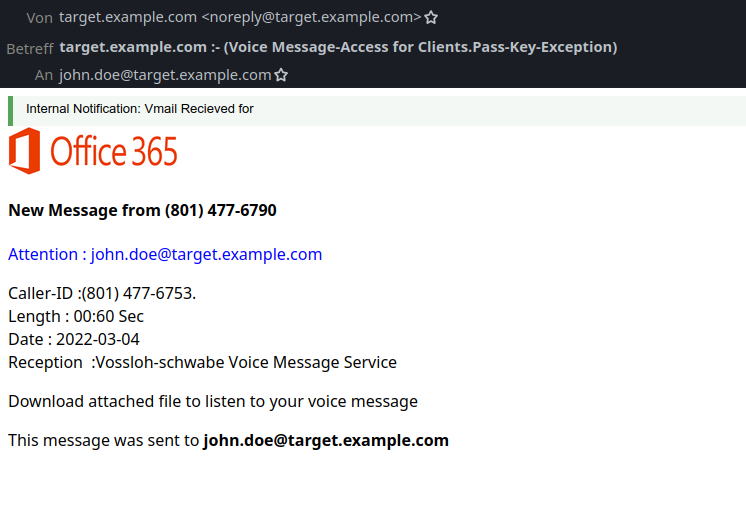
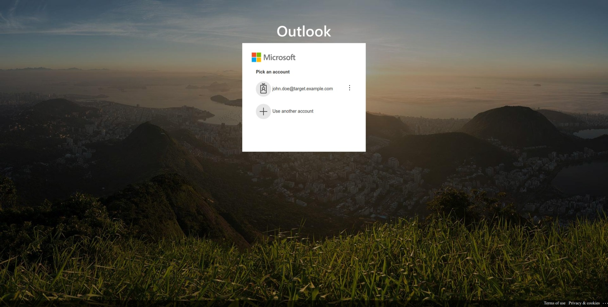

# Task 2: Phishing Email Analysis

## Overview

This project documents the analysis of a real-world phishing email sample, including header authentication, identification of phishing indicators, and explanation of the attack’s tactics. Screenshots are included as evidence of both the phishing email and its associated fake login page for thoroughness and realism.

---

## Files Included

- `phishing_sample.eml` — Raw phishing email sample (with full headers)
- `analysis_report.md` — Detailed analysis (see summary below)
- `phishing_indicators_checklist.md` — Quick reference guide to phishing red flags
- `screenshots/` — Contains all graphical evidence used in this analysis:
  - `image2.jpg`: Screenshot of the phishing email
  - `image.jpg`: Example of the fake Outlook login interface

---

## Analysis Summary

### Sample Details

- **From:** noreply@target.example.com (spoofed sender)
- **Subject:** target.example.com :- (Voice Message-Access for Clients.Pass-Key-Exception)
- **Date:** Fri, 04 Mar 2022
- **Attachment:** HTML file requesting download to access a voice message

### Key Phishing Indicators

| Indicator               | Finding / Example                                      | Risk Level |
|-------------------------|--------------------------------------------------------|------------|
| Sender Spoofing         | Uses target company’s domain but fails SPF check       | High       |
| Authentication Failure  | SPF=fail, DKIM=none, DMARC=fail in the headers        | High       |
| Suspicious Attachment   | Contains malicious HTML file as voice message          | High       |
| Urgent Language         | “Attention”, requests immediate download action        | Medium     |
| Grammar Errors          | “Vmail Recieved” (typo) and formatting issues          | Medium     |
| Generic Content         | Lacks personalization, generic notification style      | Medium     |

---

## Header Authentication Findings

- **SPF:** FAIL (domain not authorized to send from this IP)
- **DKIM:** NONE (no digital signature)
- **DMARC:** FAIL (does not align with sender policy)
- **Sender IP:** Not belonging to the claimed domain

---

## Screenshots

### Phishing Email Example

 
*Demonstrates a typical phishing message requesting the user to download an attachment to hear a voice message, impersonating Office 365 and using urgency tactics.*

### Fake Login Page

 
*Shows a fake Outlook credential prompt. Users are tricked into entering real credentials, which attackers then harvest.*

---

## Process & Tools Used

- **Email collection:** Downloaded sanitized phishing sample from a reputable GitHub repository
- **Header analysis:** Mailmodo and MXToolbox Header Analyzers
- **Content review:** Manual cross-check for phishing traits (spoofing, urgencies, branding)
- **Screenshot evidence:** Visual documentation of email and associated phishing site

---

## Key Findings

- All critical email authentication failed, indicating a spoofing/phishing attempt.
- The attacker used urgency and impersonation to trick the recipient.
- Suspicious HTML attachment aimed to capture user credentials.
- Well-crafted visual branding and login page increase realism and attack effectiveness.

---

## Submission Structure

1. All project files and screenshots are uploaded in this repository.
2. Analysis report and quick-reference checklist are provided for clarity.
3. Screenshots visually demonstrate phishing tactics and end-user impacts.

---

## Conclusion

This analysis highlights the importance of technical and content-based scrutiny when reviewing suspicious emails. By identifying sender spoofing, authentication failures, and social engineering cues (supported by screenshots), this report demonstrates practical phishing defense skills according to industry expectations.

